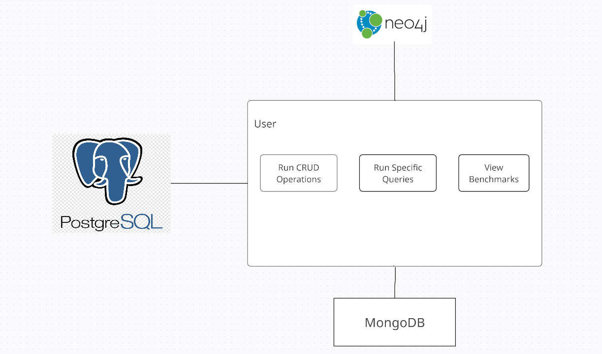
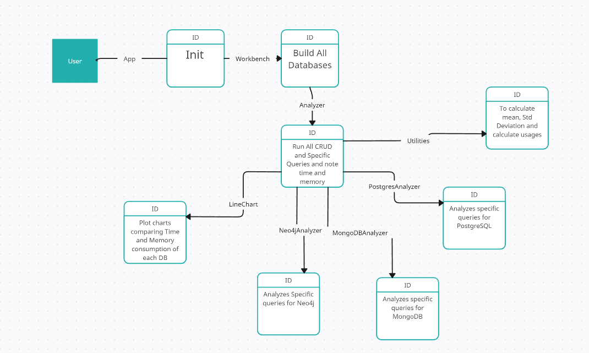

# Software Requirement Specification (SRS)

---
## 1. Introduction

---
### 1.1 Purpose of the Project

The aim of this project is to conduct a comprehensive analysis of various database management systems, including PostgreSQL, MongoDB, and Neo4j. The evaluation is focused on assessing their respective performances across multiple metrics such as speed, memory utilization, and scalability. The study endeavors to provide a thorough comparison of relational, non-relational, and graph databases to enable decision-makers to make informed choices based on their specific needs and requirements.

### 1.2 Scope of the Project

The scope of this project is to perform a comprehensive comparative analysis of three different database management systems - PostgreSQL, MongoDB, and Neo4j. The focus will be on evaluating their performance in handling a large amount of CRUD (Create, Read, Update, Delete) queries, which will be similar for all three databases, as well as specific queries that are unique to each database. The performance evaluation will cover multiple metrics, including speed, memory usage, and scalability.

To achieve the project's objectives, we will design and execute a set of benchmark tests to simulate a realistic usage scenario for each of the three databases. We will measure the performance of each database by running queries and analyzing their response time, memory usage, and scalability. The test results will be used to generate performance comparison charts and graphs for each database.

### 1.3 Document Conventions

The document follows the IEEE standard for SRS documentation.

### 1.4 Intended Audience

The intended audience for this project is developers who are seeking guidance on selecting the most optimal database management system for their project. The project aims to provide insights and recommendations on the performance characteristics of PostgreSQL, MongoDB, and Neo4j databases, which can assist developers in making informed decisions about which database to use based on their specific needs and requirements.

The project report will provide a detailed analysis of the performance of these three databases, including metrics such as speed, memory usage, and scalability. It will also highlight the strengths and weaknesses of each database, and suggest optimal configurations for the best performance.

## 2. Overall Description

---
### 2.1 Product Perspective

The project aims to perform a comparative analysis of three different database management systems - PostgreSQL, MongoDB, and Neo4j, with a focus on evaluating their performance in handling a large amount of CRUD (Create, Read, Update, Delete) queries. The project will analyze multiple models for each table, and the analyzer will randomly choose a column of the table to perform CRUD operations on it to check benchmarks. Additionally, specific queries unique to each database will be performed, and each database will have a different class to execute these queries. The performance evaluation will cover multiple metrics, including speed, memory usage, and scalability.

### 2.2 Product Functionality

The functions that our project will perform are as follows:

- Perform CRUD operations on each database in their respective models.
- Design and execute a set of benchmark tests to simulate a realistic usage scenario for each of the three databases.
- Measure the performance of each database by running queries and analyzing their response time, memory usage, and scalability.
- Generate performance comparison charts and graphs for each database.
- Collect and analyze data on each database's ability to handle high-traffic scenarios and assess their fault tolerance.

### 2.3 Operating Environment

The operating environment for this project is listed below:

- Database Management Systems: PostgreSQL 15.2, MongoDB 6.0.5, and Neo4j 5.6.0
- Operating System: Ubuntu 20.04
- Programming Language: Java 17.0.6
- Build Tool: Gradle 8.0.2

## 3. Block Diagram

---

## 4. Software Stack

---
### 4.1 Database Management Systems

The three database management systems that we will be using for this project are PostgreSQL, MongoDB, and Neo4j. PostgreSQL is a relational database management system that uses SQL as its query language. MongoDB is a document-oriented database management system that uses JSON-like documents with dynamic schemas. Neo4j is a graph database management system that uses graph structures to store data.

## 5. Specific System Features and Requirements

---
### 5.1 Hardware Requirements

The hardware requirements for this project are listed below:

- CPU: Intel Core i3 or higher
- RAM: 4 GB or higher
- Storage: Enough space to store the databases and benchmarking tools
- Network: Internet connection to download the required software

### 5.2 Software Requirements

The software requirements for this project are listed below:

- Operating System: Ubuntu 20.04
- Integrated Development Environment (IDE) such as IntelliJ IDEA, Eclipse, or NetBeans.
- A web browser for viewing the results of the benchmark tests.

### 5.3 Non-Functional Requirements

The non-functional requirements for this project are listed below:

- Performance: The benchmark tests should be able to run on a single machine with minimal resources.
- Security: The project must ensure that data privacy and security are maintained during testing and benchmarking.
- Compatibility: The system must be compatible with different operating systems, browsers, and database management systems.
- Usability: The system should be easy to use and understand for non-technical users.
- Reliability: The system should be reliable and stable during testing and benchmarking.
- Maintainability: The project must be well-organized and well-documented to facilitate easy maintenance and future upgrades.
- Scalability: The system should be able to handle a large number of concurrent users and requests without any performance degradation.

## 6. Functional Requirements

---
### 6.1 Benchmark Tests

The benchmark tests will be designed to simulate a realistic usage scenario for each of the three databases. The tests will be designed to measure the performance of each database by running queries and analyzing their response time, memory usage, and scalability.

### 6.2 Performance Comparison

The performance comparison will be done by generating performance comparison charts and graphs for each database. The charts and graphs will be generated using the data collected from the benchmark tests.

## 7. Interface Requirements

---
### 7.1 Command Line Interface

The command line interface will be used to run the benchmark tests and generate performance comparison charts and graphs.

## 8. Assumptions and Dependencies

---
### Assumptions

- The response time will include the time taken to initialize the database, execute the query, collect result and the time taken to return the result.
- The memory usage will include the memory used by the database and the benchmarking tool assuming ideal conditions and no other processes running on the system.

### Dependencies

- The benchmark tests will be dependent on the database management systems and the benchmarking tool.
- The time taken to initialize the database and run the queries will be dependent on the hardware and software configuration of the system.

## 9. Constraints

---
- The benchmark tests will be conducted while taking into account the constraints imposed by the hardware and software configuration of the system.
- NoSQL databases are designed to handle data manipulation at a large scale, often involving terabytes (TBs) or petabytes (PBs) of data. However, it is important to note that achieving such scales may be constrained by the hardware limitations of the system being used for benchmarking.

## 10. Dataflow Diagram

---

## 11. User Description

---
### 11.1 User Characteristics

The user for this project is a developer or data analyst who is looking to compare the performance of different types of databases - Postgresql (relational database), MongoDB (non-relational database), and Neo4j (graph database) - on various metrics such as speed, memory usage, and scalability. The user should have a basic understanding of database management systems, Java programming language, and benchmark testing. The user may be interested in selecting the optimal database management system for a specific project based on its performance characteristics. 

### 11.2 User Actions

The user will be able to perform the following actions:

- The system will provide the user with the ability to run benchmark tests on the three databases.
- The system will allow the user to view the results of the benchmark tests for each database.
- The system will generate performance comparison charts and graphs for each database to allow the user to easily compare the performance of each database.

## 12. Workflow and Timeline

---
- Evaluation 1: The first stage of the project involves the preparation of the SRS document. The project team will work on creating a comprehensive SRS document that outlines the scope, requirements, and objectives of the project. This document will serve as a blueprint for the entire project, and will be used to guide the project team throughout the project lifecycle.

- Evaluation 2: The second stage of the project involves the development of an initial testing plan. The project team will identify the different categories of DBMS and will decide on the specific DBMS to be tested for each category. The team will also select the benchmarking tools to be used for the testing.

- Evaluation 3: In the third stage of the project, the project team will finalize the specific DBMS to be used for each category. The team will also finalize the benchmarking tools to be used for the testing. 

- Evaluation 4: The fourth stage of the project involves creating a roadmap for the project and beginning the development phase. The project team will identify the specific tasks to be completed, the timelines for each task, and the resources required for each task.

- Evaluation 5: In the final stage of the project, the project team will write specific queries and test the DBMS on different benchmarks. The team will use a variety of data sets to ensure that the tests are comprehensive and representative of real-world scenarios. The results of the testing will be analyzed, and the team will generate visualizations and reports to present the results of the analysis.

## 13. Contributors

---
1. Aman Kumar (2020CSB1153)
2. Anubhav Kataria (2020CSB1073)
3. Ojassvi Kumar (2020CSB1187)
4. Rishabh Jain (2020CSB1198)
5. Vinay Kumar (2020CSB1141)