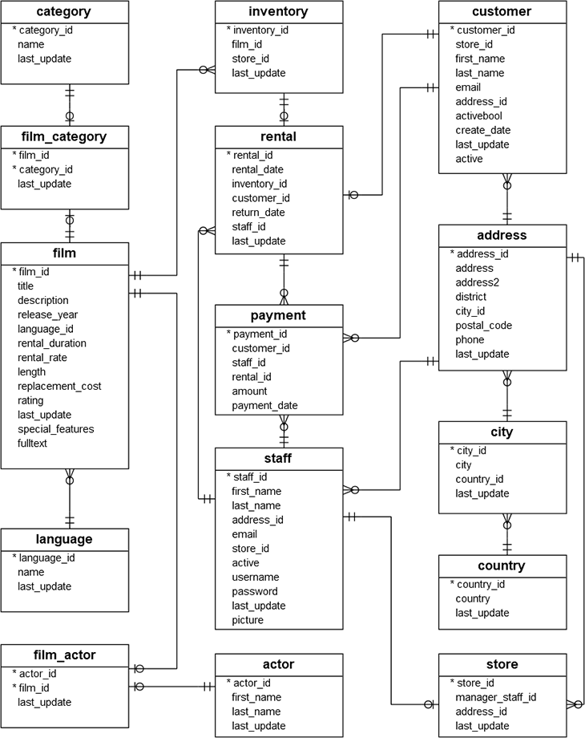
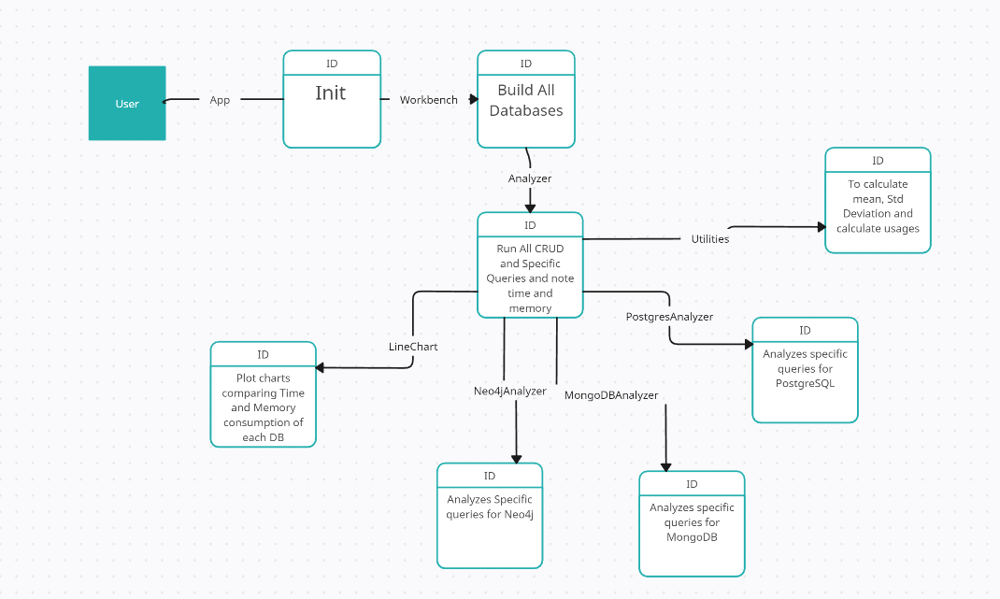

# Design Document

---
## 1. Introduction

---
### 1.1 Description of the project

This project perform a comparative analysis of three popular database management systems - PostgreSQL, MongoDB, and Neo4j - to determine their performance in handling a large amount of CRUD (Create, Read, Update, Delete) queries. We will execute a set of benchmark tests to simulate a realistic usage scenario for each of the databases, and then measure the performance of each database by running queries and analyzing their response time, memory usage, and scalability. We will generate performance comparison charts and graphs for each database. The project will cover multiple metrics, including speed, memory usage, and scalability. Additionally, we will test specific queries that are unique to each database to evaluate their strengths and limitations.

### 1.2 Aim of the project

The aim of this project is to help developers choose the most suitable database management system for their specific needs. By performing a comparative analysis of PostgreSQL, MongoDB, and Neo4j, we aim to provide insights into the strengths and weaknesses of each system in terms of handling CRUD queries and specific queries. The project will be of significant value to developers who are in the process of choosing a database management system for their application, as it will help them make an informed decision based on their specific requirements. Our ultimate goal is to provide a comprehensive evaluation of the three systems to guide developers towards the best choice for their project.

### 1.3 Working of the project

The project follows a modular architecture and is composed of multiple classes that work together to perform various tasks. At a high level, the working of the project involves designing and executing benchmark tests for three different database management systems: PostgreSQL, MongoDB, and Neo4j. These benchmark tests simulate a realistic usage scenario for each database and include both generic CRUD queries and specific queries unique to each database.

The project utilizes a generic Model class that defines the structure of the tables for each database. The Model class is used by the Database class, which performs the actual CRUD queries on the tables. The queries are performed in a randomized manner, selecting any random parameter from the table to perform the operation on.

The Analyzer class is responsible for analyzing the response time, memory usage, and scalability of each database. It generates performance comparison charts and graphs for each database, enabling easy comparison between the databases.

## 2. General Description

---
### 2.1 Product Perspective

The project aims to perform a comparative analysis of three different database management systems - PostgreSQL, MongoDB, and Neo4j, with a focus on evaluating their performance in handling a large amount of CRUD (Create, Read, Update, Delete) queries. The project will analyze multiple models for each table, and the analyzer will randomly choose a column of the table to perform CRUD operations on it to check benchmarks. Additionally, specific queries unique to each database will be performed, and each database will have a different class to execute these queries. The performance evaluation will cover multiple metrics, including speed, memory usage, and scalability.

### 2.2 Tools Used

- Lucid Chart:  Lucid chart a Web-based UML design program, is used to generate all the diagrams used in the analysis and design phases of the project.
- PostgreSQL: PostgreSQL is a powerful, open source object-relational database system with over 30 years of active development that has earned it a strong reputation for reliability, feature robustness, and performance.
- MongoDB: MongoDB is a general purpose, document-based, distributed database built for modern application developers and for the cloud era.
- Neo4j: Neo4j is a native graph database, built from the ground up to leverage not only data but also data relationships.

## 3. Design Details

---
### 3.1 Architecture

The overall logical architecture of the project can be divided into two main components: the database management system and the benchmarking tool.

- The database management system component includes three different systems: PostgreSQL, MongoDB, and Neo4j. Each system will have its own model for each table, and they will all perform CRUD operations in their own unique way. The analyzer will randomly choose a column of the table to perform CRUD operations on to check benchmarks. Additionally, each database will have a different class that will perform specific queries for those databases.

- The benchmarking tool component will simulate a realistic usage scenario for each of the three databases. The tool will measure the performance of each database by running queries and analyzing their response time, memory usage, and scalability. It will generate performance comparison charts and graphs for each database, which will allow the user to easily compare the performance of each database and make an informed decision on which database to use for their project.

Overall, the logical architecture of the project is designed to provide an objective and comprehensive analysis of the performance of three popular database management systems, with the aim of helping developers make informed decisions about which database to use for their project.

### 3.2 Database Design

### 3.3 Classes

Below is a list of major classes that will be used in the project:

- App: This class will be the main class of the project. It will contain the main method, which will be used to run the project.
- WorkBench: This class will be used to call the builder class which will be used to initialize all the databases. It will also call the analyzer class which will be used to analyze the performance of the databases.
- Builder: This class will be used to initialize all the databases.
- Analyzer: This class will be used to analyze the performance of the databases by running queries and analyzing their response time, memory usage, and scalability.
- Utilities: This class will be used to generate performance comparison charts and graphs for each database.

**Below is detailed class diagram of the project:**

### 3.4 Sequence Diagram

### 3.5 State Diagram

Img

### 3.6 Work Flow Diagram

